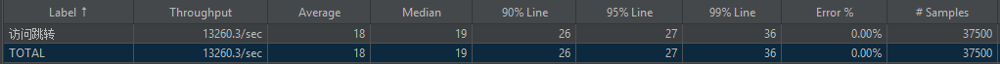

# LinkHub

LinkHub 是一个基于 Spring Cloud Alibaba 构建的高并发短链接平台，提供短链生成、跳转访问、链接管理和访问统计等核心能力。

项目围绕短链接系统中的高并发访问、缓存一致性、异步统计以及海量数据存储等问题进行设计，通过多级缓存、消息队列、分库分表和分布式锁等机制提升系统性能、稳定性与扩展能力。

## 技术栈

**Spring Boot / Spring Cloud Alibaba / Redis / Caffeine / RocketMQ / ShardingSphere / MySQL / Redisson / Sentinel**

## 核心设计

* **多级缓存**
  针对短链跳转高频读、数据库容易成为瓶颈的问题，构建 `Caffeine + Redis + BloomFilter + 空值缓存 + 分布式锁` 多级缓存体系，降低热点请求对数据库的访问压力。

* **异步访问统计**
  针对高并发场景下统计数据实时写库压力较大的问题，基于 `RocketMQ + Redis 聚合 + 定时批量落库` 构建异步统计链路，实现跳转请求与统计处理解耦。

* **缓存一致性**
  采用 Cache Aside 更新策略，并结合缓存删除失败重试、TTL 与本地缓存广播机制，降低多节点环境下数据库与缓存短暂不一致带来的影响。

* **消息消费幂等**
  基于 Redis 实现 RocketMQ 消息消费幂等控制，避免消息重复投递导致 PV、UV 等统计数据重复累加。

* **分库分表**
  基于 ShardingSphere 对短链接数据进行分片，并结合路由机制优化海量短链接场景下的数据存储与查询性能。

* **并发与服务保护**
  基于 Redisson 分布式读写锁保障并发修改安全，并结合 Sentinel 限流与降级机制提高高并发场景下的系统可用性。

## 项目结构

```text
LinkHub
├── admin          # 后台管理服务
├── gateway        # 网关服务
├── project        # 短链接核心服务
├── console-vue    # WEB 管理端
└── resources      # sql脚本
```

## 性能测试

短链接跳转接口压测结果：

* 平均 RT：**18 ms**
* P95：**26 ms**
* QPS：**13.2K**

访问统计链路可稳定支撑 **10K+ QPS** 场景下的异步处理。


### 压测截图



## License

本项目仅用于学习与技术交流。
